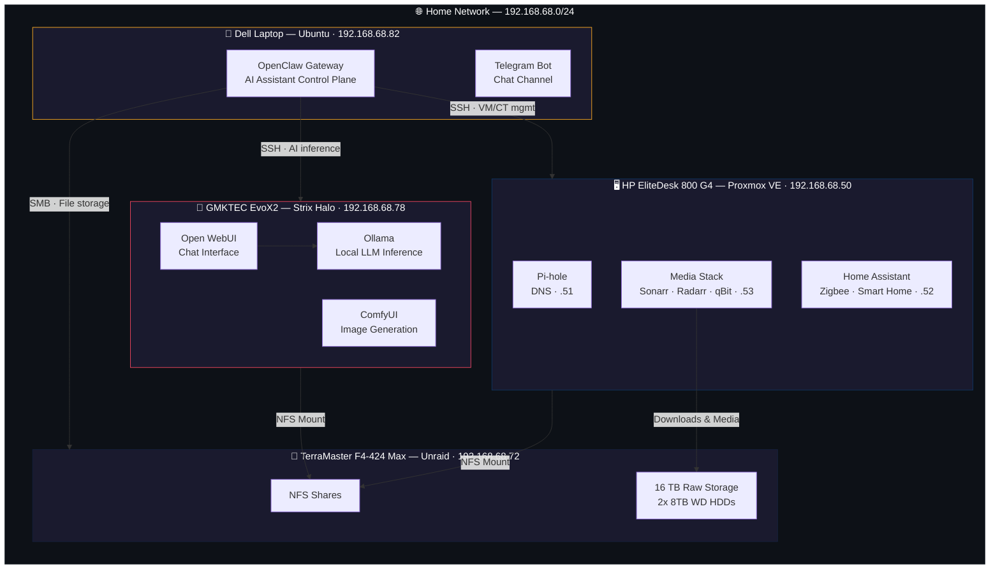

# 🏠 Homelab — Local-First AI & Self-Hosted Infrastructure

A multi-node homelab built around **local AI inference**, **self-hosted services**, **smart home automation**, and an **AI assistant control plane** — fully declared as code.

The driving philosophy: everything runs locally. LLMs, image generation, DNS, media automation, home automation — no cloud dependencies, no subscriptions, no data leaving the network.

## Architecture



## Hardware

| Machine | Role | CPU | RAM | Storage | OS |
|---------|------|-----|-----|---------|----|
| **GMKTEC EvoX2** | AI / ML Inference | AMD Strix Halo (Ryzen AI Max) | 128 GB DDR5 (unified) | 2 TB NVMe | Ubuntu 24.04 |
| **Dell Laptop** | AI Assistant Gateway | — | — | — | Ubuntu 24.04 |
| **HP EliteDesk 800 G4 Mini** | Virtualization & Services | Intel 8th Gen | 32 GB DDR4 | 2x NVMe SSD | Proxmox VE |
| **TerraMaster F4-424 Max** | NAS & Storage | Intel N95 | 32 GB DDR5 | 2x 8TB HDD + 1TB NVMe + 256GB NVMe | Unraid |

## Services

| Service | Machine | Purpose | Access |
|---------|---------|---------|--------|
| **Ollama** | Strix Halo | Local LLM inference (Llama, Mistral, etc.) | `192.168.68.78:11434` |
| **Open WebUI** | Strix Halo | Chat interface for Ollama | `192.168.68.78:8080` |
| **ComfyUI** | Strix Halo | Local image generation (Stable Diffusion) | `192.168.68.78:8188` |
| **OpenClaw** | Dell Laptop | AI assistant gateway with Telegram integration | `192.168.68.82:18789` |
| **Pi-hole** | Proxmox LXC | Network-wide DNS ad blocking | `192.168.68.51` |
| **Sonarr / Radarr / Prowlarr** | Proxmox LXC | Media automation | `192.168.68.53` |
| **qBittorrent** | Proxmox LXC | Download client (VPN-protected) | `192.168.68.53` |
| **Home Assistant** | Proxmox VM | Smart home automation & Zigbee | `192.168.68.52` |

## Why Local?

Cloud AI APIs are convenient. But running models locally means:

- **Privacy** — conversations, images, and prompts never leave my network
- **No rate limits** — inference runs as fast as the hardware allows
- **No recurring costs** — after hardware investment, inference is free
- **Real learning** — configuring GPU drivers, memory allocation, and model optimization teaches you things that API calls never will

The Strix Halo's 128 GB of unified memory is the centerpiece — it can load large language models (70B+ parameter) and run Stable Diffusion image generation with ~96 GB VRAM allocation, producing images in roughly 7 seconds.

## OpenClaw — AI Assistant Control Plane

[OpenClaw](https://github.com/openclaw/openclaw) is an open-source personal AI assistant that runs on your own devices. It acts as the control plane for my homelab, connecting all machines through a unified interface accessible via Telegram.

The gateway runs on the Dell laptop (`ubuntupn`) and has SSH access to the Strix Halo and Proxmox, plus SMB access to the NAS — giving it the ability to manage infrastructure, run AI workloads, and access stored files, all from a chat interface.

### Multi-Machine Access & Security Model

Rather than giving OpenClaw root access everywhere, I created a dedicated low-privilege `adrian` user across all machines with carefully scoped permissions:

| Machine | Access Method | Permissions |
|---------|---------------|-------------|
| **Strix Halo** | SSH (ed25519 key) | Read journals, interact with Ollama — no sudo |
| **Proxmox** | SSH + PAM API | Custom `AssistantRole` — can monitor, start/stop, create VMs/CTs, allocate storage. Cannot delete other users' VMs, change node settings, or manage users |
| **Unraid NAS** | SMB (mounted at `/mnt/nas`) | Read/write to dedicated `openclaw` share only |

Ollama's network port on the Strix Halo is firewalled to only accept connections from the OpenClaw gateway:

```bash
sudo ufw allow from 192.168.68.82 to any port 11434
```

The OpenClaw dashboard requires HTTPS or localhost for WebSocket connections, so LAN access uses an SSH tunnel:

```bash
ssh -L 18789:127.0.0.1:18789 adrian@192.168.68.82
```

Telegram DMs use pairing-based security — unknown senders receive a code that must be manually approved before the bot responds.

See [`openclaw/openclaw.json.example`](openclaw/openclaw.json.example) for the obfuscated configuration template.

## Challenges & Learnings

### Getting ROCm Working on Bleeding-Edge Hardware

The Strix Halo uses AMD's `gfx1151` GPU architecture, which had **no official ROCm support** at the time of setup. Getting local AI inference working required:

- **Community-built PyTorch wheels** — official AMD wheels didn't support gfx1151, so I used builds from community developers targeting this specific architecture
- **Custom kernel parameters** — tuned `amdgpu.gttsize` and `ttm.pages_limit` to allocate ~96 GB of the 128 GB unified memory to GPU workloads, leaving ~32 GB for the OS and OpenClaw operations
- **ROCm environment overrides** — set `HSA_OVERRIDE_GFX_VERSION` and `PYTORCH_HIP_ALLOC_CONF` to make the stack recognize and properly utilize the hardware

This is the kind of problem you only encounter when you're running real workloads on hardware that's ahead of the software ecosystem — exactly where production edge-AI deployments often land.

### Separation of Concerns

Each machine has a clear role: NAS handles storage, Proxmox hosts general services in isolated containers, the Strix Halo is dedicated to GPU-heavy AI workloads, and the Dell laptop runs the always-on AI assistant gateway. This mirrors how production infrastructure separates compute, storage, and orchestration — and makes troubleshooting significantly easier.

### Least-Privilege Access Across Machines

The OpenClaw integration required creating a consistent security model across four machines running three different operating systems (Ubuntu, Proxmox, Unraid). Each machine has a dedicated service user with only the permissions needed — SSH key auth where possible, custom Proxmox API roles with granular privilege sets, and SMB shares scoped to a single directory. No machine trusts the assistant with more than it needs.

### VPN-Protected Downloads

The media automation stack routes all traffic through a VPN at the container level, so only download traffic is tunneled while the rest of the network operates normally. This was configured using split-tunneling within the LXC container.

## Smart Home

Home Assistant runs as a dedicated VM on Proxmox with Zigbee device integration planned. The goal is full local control of lighting, sensors, and automation — no cloud hubs, no vendor lock-in.

_(Zigbee coordinator and device integration in progress)_

## Repo Structure

```
homelab/
├── README.md                          # You are here
├── strix-halo/
│   ├── docker-compose.yml             # Open WebUI
│   ├── comfyui.service                # systemd unit for ComfyUI
│   ├── setup.sh                       # Reproducible setup script
│   ├── .env.example                   # Environment variables template
│   └── README.md                      # Strix Halo specific docs
├── openclaw/
│   ├── openclaw.json.example          # Obfuscated config template
│   ├── openclaw.service               # systemd user service
│   └── README.md                      # OpenClaw setup & security model
├── proxmox/
│   ├── pihole/
│   │   └── docker-compose.yml
│   ├── media-stack/
│   │   ├── docker-compose.yml         # Sonarr, Radarr, Prowlarr, qBit
│   │   └── .env.example
│   ├── home-assistant/
│   │   └── README.md                  # VM setup notes
│   └── README.md                      # Proxmox host config & LXC setup
├── nas/
│   └── README.md                      # Unraid config, shares, NFS exports
└── docs/
    ├── hardware.md                    # Detailed hardware specs
    ├── network.md                     # IP assignments, DNS, VPN
    └── recovery.md                    # Disaster recovery runbook
```

## Roadmap

- [ ] Zigbee coordinator setup with Home Assistant
- [ ] k3s cluster across homelab nodes
- [ ] Voice processing pipeline (Whisper + Piper for STT/TTS)
- [ ] Vaultwarden for self-hosted password management
- [ ] Frigate NVR for camera monitoring
- [ ] Comprehensive backup automation to NAS
- [ ] GitOps workflow with ArgoCD

## License

MIT
